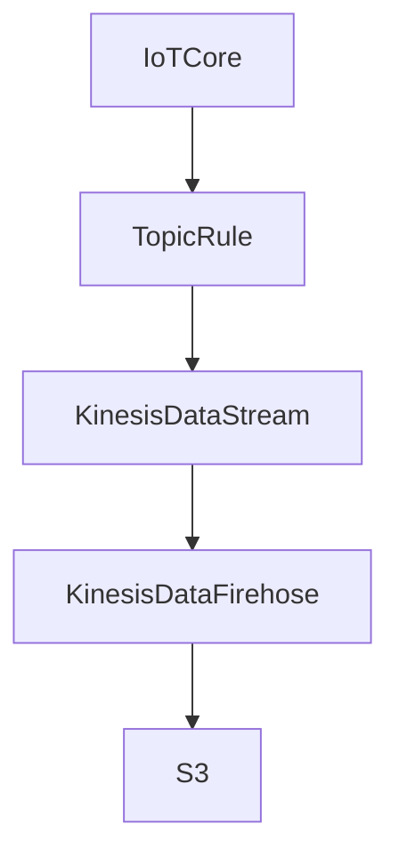

## About This Repository

This repository is a sample project that uses the AWS Cloud Development Kit (CDK) to save messages sent from an IoT Topic Rule through Kinesis Data Streams and Kinesis Data Firehose, and then using Lambda, to S3.

## Data flow architecture



## Prerequisites

Before starting this project, please complete the following steps:

1. **Create an AWS IAM User**: Create a user in AWS IAM with permissions to execute CDK Bootstrap and CDK Deploy.
2. **Set Up an AWS CLI Profile**: Use the credentials of the IAM user you created to set up an AWS CLI profile in your local environment.

## How to Deploy

To deploy the project, follow these steps:

1. **Execute CDK Bootstrap**:
    ```shell
    ./cdk-bootstrap.sh {your-aws-profile}
    ```
   This prepares CDK for deploying AWS resources.

2. **Deploy the Project**:
    ```shell
    ./cdk-deploy.sh {your-aws-profile}
    ```
   This command creates the necessary AWS resources.

After a successful deployment, use the AWS IoT MQTT test client to send messages and check the results.

1. Open the [MQTT test client](https://ap-northeast-1.console.aws.amazon.com/iot/home?region=ap-northeast-1#/test) in the AWS Management Console.
2. Select *Publish to a topic* and enter any topic name.
3. Click the *Publish* button to send a message.

Approximately 60 seconds later, you can confirm that the sent message has been saved to S3. In this process, Lambda is used as a data processor, but here it only outputs logs for demonstration purposes. If necessary, you can add custom processing to transform the data before saving it to S3.

## How to Remove the Environment

Before deleting the project, empty the S3 bucket you created.

Next, execute the following command to delete all deployed resources:

```shell
./cdk-destroy.sh {your-aws-profile}
```

This procedure will remove all resources created for this project.